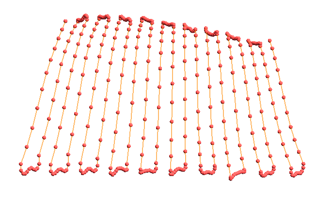

# RFICP
 RFICP is a key component of the methodology proposed in our paper(Semantic and Terrain-Aware Trajectory Optimization for Uniform Coverage
in Obstacle-Laden Environments).

**Radiant-Field-Informed Coverage Planning (RFICP) for Autonomous Terrain Coverage**

A Python implementation of terrain analysis and adaptive path planning using point cloud data, featuring field-informed speed optimization based on environmental semantics.


## 🎯 Overview

This tool implements the Radiant-Field-Informed Coverage Planning (RFICP) algorithm for autonomous robotic coverage of terrain surfaces. It processes point cloud data to:

- Generate optimal zigzag coverage paths
- Adaptively adjust robot speed based on environmental field values (e.g., aridity, contamination)
- Visualize terrain, semantic fields, and planned trajectories
- Support various point cloud formats (PCD, PLY, XYZ, NPZ)

## 🚀 Features

- **Point Cloud Processing**: Load and process terrain data from multiple formats
- **Surface Reconstruction**: Poisson reconstruction for continuous terrain representation
- **Semantic Field Generation**: Create smooth environmental attribute maps (e.g., aridity distribution)
- **RFICP Speed Planning**: Physics-based speed calculation for efficient coverage
- **3D Visualization**: Interactive visualization of terrain, paths, and speed profiles
- **Flexible Parameters**: Extensive customization options for different scenarios

## 📋 Requirements

```bash
trimesh>=3.9.0
numpy>=1.20.0
pyvista>=0.38.0
open3d>=0.15.0
scipy>=1.7.0
```

## 🔧 Installation

1. Clone the repository:
```bash
git clone https://github.com/yourusername/RFICP-Terrain-Analysis.git
cd RFICP-Terrain-Analysis
```

2. Install dependencies:
```bash
pip install -r requirements.txt
```

## 💻 Usage

### Basic Usage

```bash
python src/RFICP.py data/terrain.pcd
```

### Advanced Options

```bash
python src/RFICP.py data/terrain.pcd \
    --line-spacing 0.3 \
    --point-spacing 0.05 \
    --altitude 0.5 \
    --visualize all
```

### RFICP Parameter Tuning

```bash
python src/RFICP.py data/terrain.pcd \
    --rficp-k 2.0 \              # Proportional coefficient
    --rficp-c-target 0.2 \       # Target coverage level
    --rficp-lambda 1.5 \         # Coverage efficiency
    --rficp-R 1.5 \              # Influence radius
    --rficp-sigma 0.7 \          # Gaussian std deviation
    --v-min 0.3 \                # Minimum velocity (m/s)
    --v-max 8.0                  # Maximum velocity (m/s)
```

## 📊 Visualization Modes

The tool offers multiple visualization modes:

### 1. Terrain Map
Displays the original point cloud with colors
```bash
python src/RFICP.py data/terrain.pcd --visualize terrain
```


### 2. Surface Reconstruction
Shows the Poisson-reconstructed surface mesh
```bash
python src/RFICP.py data/terrain.pcd --visualize surface
```


### 3. Aridity Map
Visualizes the generated environmental field
```bash
python src/RFICP.py data/terrain.pcd --visualize aridity
```


### 4. Trajectory Coverage
Shows the planned zigzag coverage path
```bash
python src/RFICP.py data/terrain.pcd --visualize trajectory
```


### 5. Speed Visualization
Displays speed variations along the path
```bash
python src/RFICP.py data/terrain.pcd --visualize speed
```


### 6. Combined View
Shows all elements together
```bash
python src/RFICP.py data/terrain.pcd --visualize combined
```


## 🎛️ Command Line Arguments

| Argument | Type | Default | Description |
|----------|------|---------|-------------|
| `input` | str | required | Input point cloud file path |
| `--downsample` | int | 25000 | Target number of points after downsampling |
| `--downsample-method` | str | random | Method: random, voxel, or uniform |
| `--poisson-depth` | int | 9 | Depth of Poisson reconstruction |
| `--line-spacing` | float | 0.5 | Spacing between coverage lines (m) |
| `--point-spacing` | float | 0.1 | Spacing between waypoints (m) |
| `--altitude` | float | 1.0 | Flight altitude above terrain (m) |
| `--aridity-resolution` | int | 100 | Resolution of semantic field grid |
| `--no-rotate` | flag | False | Disable auto-rotation from XZ to XY plane |

### RFICP-Specific Parameters

| Argument | Type | Default | Description |
|----------|------|---------|-------------|
| `--rficp-k` | float | 1.0 | Proportional coefficient for desired coverage |
| `--rficp-c-target` | float | 0.1 | Target coverage level |
| `--rficp-lambda` | float | 1.0 | Coverage efficiency constant |
| `--rficp-R` | float | 1.0 | Radius of influence circle (m) |
| `--rficp-sigma` | float | 0.5 | Gaussian kernel standard deviation |
| `--v-min` | float | 0.5 | Minimum velocity constraint (m/s) |
| `--v-max` | float | 5.0 | Maximum velocity constraint (m/s) |

## 📐 Algorithm Details

### RFICP Speed Calculation

The speed at each waypoint is calculated based on the environmental field value using:

```
v(p) = -λ / ln[1 - (k·A(p) - C_target) / (2·F(R/σ) - 1)]
```

Where:
- `A(p)`: Environmental field value at position p
- `k`: Proportional coefficient
- `C_target`: Target coverage level
- `λ`: Coverage efficiency constant
- `F(R/σ)`: Gaussian CDF value
- Speed is inversely proportional to required dwell time

### Coverage Strategy

1. **High Field Regions**: Lower speed → More coverage time
2. **Low Field Regions**: Higher speed → Less coverage time
3. **Smooth Transitions**: Savitzky-Golay filtering ensures smooth accelerations

## 📁 Input Formats

Supported point cloud formats:
- **PCD**: Point Cloud Data format
- **PLY**: Polygon File Format
- **XYZ**: ASCII point coordinates (with optional RGB)
- **NPZ/NPY**: NumPy array formats

## 🔄 Coordinate System

The tool automatically detects and corrects coordinate systems:
- Detects if terrain is in XZ plane
- Auto-rotates to XY plane for processing
- Use `--no-rotate` to disable auto-rotation

## 📝 Example Scripts

### Basic Coverage Mission
```bash
#!/bin/bash
# examples/run_basic.sh
python src/RFICP.py data/terrain.pcd \
    --line-spacing 0.5 \
    --altitude 2.0 \
    --visualize combined
```

### High-Resolution Precision Coverage
```bash
#!/bin/bash
# examples/run_advanced.sh
python src/RFICP.py data/terrain.pcd \
    --downsample 50000 \
    --line-spacing 0.2 \
    --point-spacing 0.05 \
    --altitude 1.0 \
    --rficp-k 1.5 \
    --rficp-R 2.0 \
    --v-max 3.0 \
    --visualize all
```

## 📊 Output

The tool provides:
- Interactive 3D visualizations
- Console output with trajectory statistics
- Path waypoints with associated speeds
- Coverage area calculations

## 🤝 Contributing

Contributions are welcome! Please feel free to submit pull requests or open issues for bugs and feature requests.

## 📄 License

This project is licensed under the MIT License - see the [LICENSE](LICENSE) file for details.

## 🔗 Citation

If you use this code in your research, please cite:

```bibtex
@software{rficp_terrain_2026,
  title = {RFICP Terrain Analysis: Radiant-Field-Informed Coverage Planning},
  author = {Zexuan Fan},
  year = {2026},
  url = {https://github.com/fanzexuan/RFICP-Terrain-Analysis}
}
```

## 📧 Contact

For questions or collaborations, please open an issue on GitHub.

---

**Note**: This tool is designed for research and educational purposes. Ensure appropriate safety measures when deploying on actual robotic systems.

